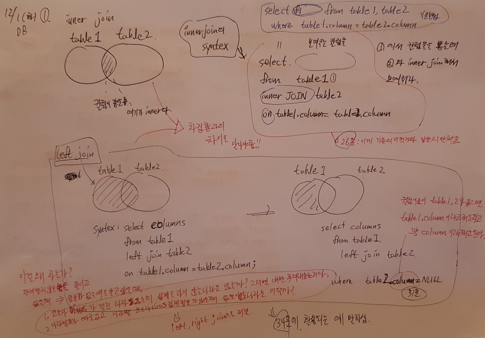

(참고> escape sequence : \ , ' ,  " 이런것들을 이렇게 부른다.)

51분 보안내용 설명>

SQL Injection Attack을 하려고 이 동영상의 해커는 hamm 뒤에 일부러 /를 붙여서 hamm/라고 입력을 했다. 그래서 일반적인 경우는해머 라는 키워드가 있을때 내가 escape sequence가 있는지 제대로 파싱을 안하고 그대로 그대로 그 데이터를 쿼리에다가 박아넣는다. 그러면 그대로 그 데이터를 쿼리에다가 넣어서 입력할때 그 쿼리문은 잘못된 쿼리문이 되어서 그래서 DB시스템에러가 return 된다. 그러면 이 return되는 시스템에러메시지를 보고 '어? mysql인가?, mariaDB인가?'라고 판단해져서 해커에게 정보를 흘려주게 되버린다.

그래서!! 우리는 파씽을 제대로 안하고 어떤 데이터포맷을 쓸지에 대해서 구체적으로 그 파씽규칙을 안쓰면 이런일을 당하게 된다는게 핵심이다.